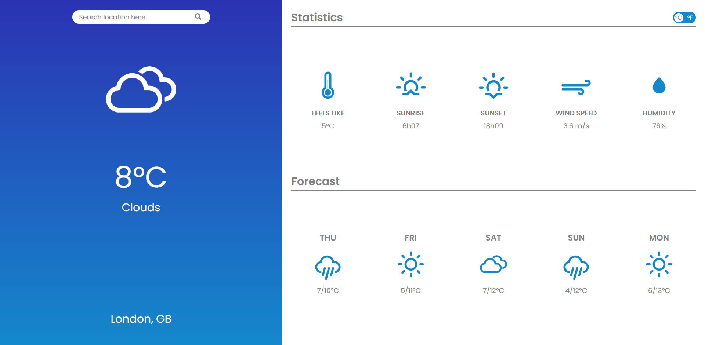

# Weather App Project
Project for [TheOdinProject](https://www.theodinproject.com/courses/javascript/) JavaScript curriculum.

The user can search for a location by city name and fetch the location's current weather data using OpenWeatherMap API.

## Features
- Fetch and display weather data from any city in the world.
- Display 5-day daily forecast data.
- Display data in metric or imperial units.
- Unique icons and colors for each weather.

**Possible future features:**
- Display current time and date for the location searched.
- Display user's location when first loading the page.

## Resources used
- [OpenWeather](https://openweathermap.org/api) API
- Weather icons by Erik Flowers: (https://erikflowers.github.io/weather-icons/)
- [date-fns](https://date-fns.org/) Module
- [Webpack](https://webpack.js.org/)

## Demo
Live version [here](https://fernanda-veiga.github.io/weather/)



## How to use
To use the website, click [here](https://fernanda-veiga.github.io/weather/).

To use the code, download all files and put them in the same directory. Inside the `/src` directory, create a new file called `api-key.js`. Inside this file, write the following code and write your own API key on the designated place:

```javascript
function generateAPIKey() {
  const API_KEY = "<your-API-key-goes-here>";
  return API_KEY;
}

export { generateAPIKey };
```

On the terminal, on the directory the files were downloaded to, install Webpack and date-fns by running `npm install webpack webpack-cli --save-dev` and `npm install date-fns --save`.

Run Webpack to create the paths and the bundle by running `npm run build`.
